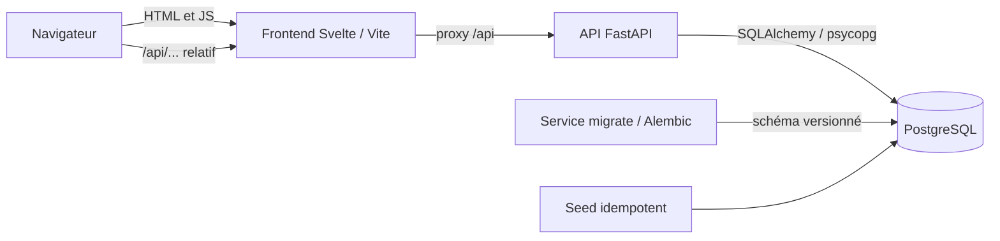

# Architecture

Cashmire est un monolithe pédagogique : le navigateur charge Svelte, Vite relaie `/api` vers FastAPI, et l’API accède à PostgreSQL. Le navigateur n’utilise jamais le DNS interne Docker.

## Backend

- `app/main.py` crée FastAPI et monte les routes sous `/api`.
- `app/core/` : paramètres d’environnement validés, sécurité (hachage Argon2id, JWT), `utilisateur_courant`, format d’erreur unique et gestionnaires, limiteur de connexion, vérification de l’origine des écritures et documentation OpenAPI (`openapi.py`).
- `app/db/` contient la base déclarative, le moteur et les sessions SQLAlchemy.
- `app/models/` représente les tables PostgreSQL ; les montants Python sont `Decimal`.
- `app/schemas/` contient les contrats Pydantic.
- `app/routes/` expose la santé, l’authentification (inscription, connexion, déconnexion, utilisateur connecté), les catégories (lecture seule), les dépenses et les budgets.
- `app/services/` contient la vérification légère de la DB, les règles métier de l’authentification, des catégories, des dépenses et des budgets, ainsi que le calcul de consommation des budgets.
- `migrations/` fait évoluer la base par Alembic. Aucun `create_all()`.
- `tests/` couvre la santé, l’authentification, les catégories, les dépenses, les budgets, le format d’erreur, la vérification d’origine, l’isolation entre utilisateurs, l’OpenAPI et la cohérence des documents avec le code (plus de 400 tests).

## Frontend

- `src/App.svelte` choisit l’écran d’après `src/lib/routes.ts` et pilote chargement, opérationnel et échec.
- `src/lib/api/` centralise `fetch`, ses types et l’erreur `ErreurApi` ; le client signale les sessions expirées sans rediriger.
- `src/lib/session.svelte.ts` porte l’état de session partagé (utilisateur, état, message).
- `src/lib/components/` contient les composants réutilisables, dont la navigation unique.
- `src/*.test.ts` teste l’interface avec Vitest et Testing Library.
- Vite cible `api:8000` côté réseau Compose. Les appels navigateur restent relatifs à l’origine.

## Intégration continue

`.github/workflows/ci.yml` s’exécute sur chaque pull request vers `main` : PostgreSQL éphémère, migrations, tests backend, puis tests frontend, vérification Svelte/TypeScript et build. Elle informe ; elle ne bloque la fusion que si la protection de la branche exige son résultat.

## Démarrage

Compose attend `pg_isready`, lance le service ponctuel `migrate`, attend sa réussite puis démarre l’API. Le frontend attend le health check de l’API. Le volume nommé `postgres_data` conserve les données. Alembic applique uniquement les versions manquantes.

## Points d’extension

- Authentification : inscription, connexion, déconnexion, `/moi` et dépendance `utilisateur_courant` en place ; le JWT n’est pas révocable côté serveur.
- Dépenses : création, liste paginée et filtrée, détail, modification et suppression, toutes filtrées par utilisateur connecté.
- Budgets : routes et calculs en `Decimal` depuis les dépenses persistées, filtrés par `utilisateur_courant`.

Les autres extensions seront ajoutées au fil des issues.
