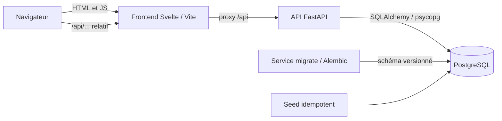

# Architecture

Cashmire est un monolithe pédagogique : le navigateur charge Svelte, Vite relaie `/api` vers FastAPI, et l’API accède à PostgreSQL. Le navigateur n’utilise jamais le DNS interne Docker.

## Backend

- `app/main.py` crée FastAPI et monte les routes sous `/api`.
- `app/core/` charge les paramètres d’environnement.
- `app/db/` contient la base déclarative, le moteur et les sessions SQLAlchemy.
- `app/models/` représente les tables PostgreSQL ; les montants Python sont `Decimal`.
- `app/schemas/` contient les contrats Pydantic.
- `app/routes/` expose uniquement `GET /api/health`.
- `app/services/` contient la vérification légère de la DB.
- `migrations/` fait évoluer la base par Alembic. Aucun `create_all()`.
- `tests/` couvre les réponses nominale et dégradée.

## Frontend

- `src/App.svelte` pilote chargement, opérationnel et échec.
- `src/lib/api/` centralise `fetch` et ses types.
- `src/lib/components/` contient la carte d’état réutilisable.
- `src/*.test.ts` teste l’interface avec Vitest et Testing Library.
- Vite cible `api:8000` côté réseau Compose. Les appels navigateur restent relatifs à l’origine.

## Démarrage

Compose attend `pg_isready`, lance le service ponctuel `migrate`, attend sa réussite puis démarre l’API. Le frontend attend le health check de l’API. Le volume nommé `postgres_data` conserve les données. Alembic applique uniquement les versions manquantes.

## Points d’extension

- Authentification : routes, schémas et services dédiés, cookie JWT HttpOnly conforme à `docs/api-design.md`.
- Dépenses : route, validation, service et tests ; filtrage par utilisateur connecté.
- Budgets : route et calculs en `Decimal` depuis les dépenses persistées.

Ce sont des points de départ documentés ; aucun fichier vide ni fonctionnalité future n’est précréé.
