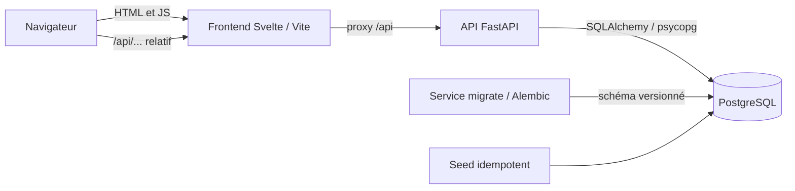

# Architecture

Cashmire est un monolithe pédagogique : le navigateur charge Svelte, Vite relaie `/api` vers FastAPI, et l’API accède à PostgreSQL. Le navigateur n’utilise jamais le DNS interne Docker.

## Backend

- `app/main.py` crée FastAPI et monte les routes sous `/api`.
- `app/core/` charge les paramètres d’environnement.
- `app/db/` contient la base déclarative, le moteur et les sessions SQLAlchemy.
- `app/models/` représente les tables PostgreSQL ; les montants Python sont `Decimal`.
- `app/schemas/` contient les contrats Pydantic.
- `app/routes/` expose la santé, l’inscription, la connexion et les routes de création, consultation, modification et suppression des budgets.
- `app/services/` contient la vérification légère de la DB, les règles métier de l’authentification et des budgets, ainsi que les calculs de consommation des budgets.
- `migrations/` fait évoluer la base par Alembic. Aucun `create_all()`.
- `tests/` couvre la santé, l’authentification et les budgets, y compris leurs erreurs et l’isolation des utilisateurs.

## Frontend

- `src/App.svelte` choisit l’écran d’après `src/lib/routes.ts` et pilote chargement, opérationnel et échec.
- `src/lib/api/` centralise `fetch`, ses types et l’erreur `ErreurApi` ; le client signale les sessions expirées sans rediriger.
- `src/lib/session.svelte.ts` porte l’état de session partagé (utilisateur, état, message).
- `src/lib/components/` contient les composants réutilisables, dont la navigation unique.
- `src/*.test.ts` teste l’interface avec Vitest et Testing Library.
- Vite cible `api:8000` côté réseau Compose. Les appels navigateur restent relatifs à l’origine.

## Démarrage

Compose attend `pg_isready`, lance le service ponctuel `migrate`, attend sa réussite puis démarre l’API. Le frontend attend le health check de l’API. Le volume nommé `postgres_data` conserve les données. Alembic applique uniquement les versions manquantes.

## Points d’extension

- Authentification : inscription, connexion, `/moi` et dépendance `utilisateur_courant` en place ; la déconnexion reste à développer.
- Dépenses : route, validation, service et tests ; filtrage par utilisateur connecté.
- Budgets : routes et calculs en `Decimal` depuis les dépenses persistées, filtrés par `utilisateur_courant`.

Les autres extensions seront ajoutées au fil des issues.
