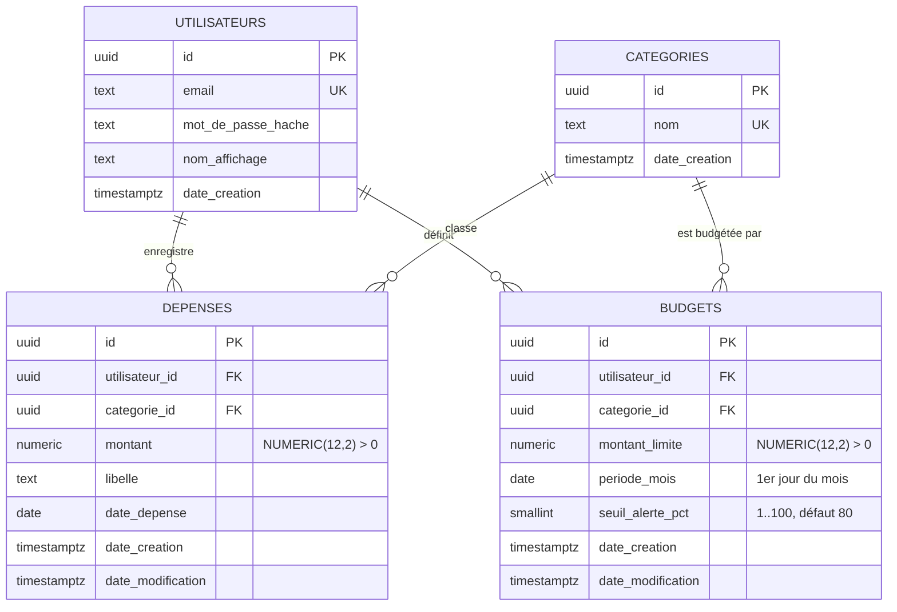

# Modèle de données PostgreSQL

Convention : **tout est en français** (tables, colonnes, contraintes, classes Python, champs de l'API), sans accents dans les identifiants techniques.

## Schéma

## Relations
- Un **utilisateur** a 0..n **dépenses** et 0..n **budgets**.
- Une **catégorie** a 0..n **dépenses** et 0..n **budgets**.
- Les **catégories** n'appartiennent à personne : elles sont prédéfinies et communes à tous (voir la décision ci-dessous).
- `ON DELETE CASCADE` sur `utilisateur_id` (dépenses et budgets) : supprimer un compte supprime ses données (utile pour le RGPD).
- `ON DELETE RESTRICT` sur `categorie_id` : on ne peut pas supprimer une catégorie utilisée par une dépense ou un budget.

## Identifiants : UUID
Les clés primaires sont des **UUID aléatoires** et non des entiers auto-incrémentés. Un entier (`/depenses/42`) peut être deviné et énuméré ; un UUID non. Cela ne remplace pas le contrôle d'appartenance (toute requête est filtrée par l'utilisateur connecté, 404 sinon), mais ajoute une seconde barrière en cas d'oubli : c'est de la défense en profondeur.

## Décision : propriété des catégories
**Catégories prédéfinies, partagées par tous les utilisateurs, en lecture seule.**

Les 6 catégories (Alimentation, Factures, Loisirs, Transport, Santé, Autre) sont créées par la migration initiale. L'API les liste mais ne permet ni d'en créer, ni d'en modifier, ni d'en supprimer. La table `categories` n'a donc pas de colonne `utilisateur_id`.

**Pourquoi :**
- C'est le périmètre du MVP : l'énoncé demande des budgets « par catégorie (alimentation, factures, loisirs) » mais aucune gestion de catégories.
- Un nouvel utilisateur peut saisir une dépense tout de suite, sans configuration (parcours d'accueil court).
- Moins de code, moins d'écrans, moins de tests : aucune route d'écriture à protéger sur cette ressource.
- Aucune donnée de catégorie n'appartient à un utilisateur, donc il n'y a rien à isoler.

**Alternatives écartées pour le MVP :**
- *Catégories mixtes (défaut + personnelles)* : demande une colonne `utilisateur_id` nullable, deux index uniques partiels, des routes d'écriture et des tests d'isolation en plus.
- *Toutes personnelles* : il faudrait copier les catégories de base à chaque inscription.

**Évolution possible (extension, après le MVP) :** les catégories personnelles. Elles s'ajouteraient par une **nouvelle** migration (colonne `utilisateur_id` nullable, `NULL` = catégorie prédéfinie) sans casser l'existant.

## Règles métier et contraintes
| Règle | Où elle est appliquée |
|---|---|
| Montant de dépense strictement positif | `CHECK (montant > 0)` + validation Pydantic |
| Limite de budget strictement positive | `CHECK (montant_limite > 0)` |
| Montants exacts | `NUMERIC(12,2)` en base, `Decimal` en Python, chaîne dans le JSON |
| Email unique, insensible à la casse | Index unique sur `lower(email)` |
| Nom de catégorie unique, insensible à la casse | Index unique sur `lower(nom)` |
| Un seul budget par (utilisateur, catégorie, mois) | `UNIQUE (utilisateur_id, categorie_id, periode_mois)` |
| `periode_mois` est toujours le 1er du mois | `CHECK (EXTRACT(DAY FROM periode_mois) = 1)` |
| Seuil d'alerte entre 1 et 100 | `CHECK (seuil_alerte_pct BETWEEN 1 AND 100)` |
| Une dépense ou un budget référence une catégorie existante | Clé étrangère `categorie_id` |

## Décisions issues de la revue du schéma d'un coéquipier
Le schéma proposé par un membre de l'équipe a été comparé à celui-ci. Décisions :

| Point | Décision |
|---|---|
| Mois et année en deux entiers (`mois`, `annee`) | Remplacés par **une seule colonne `periode_mois` de type `date`** (1er du mois) avec `CHECK` : impossible d'avoir un mois 13, et la comparaison avec `date_depense` est directe. |
| Pas d'unicité sur les budgets | Ajout de `UNIQUE (utilisateur_id, categorie_id, periode_mois)`. |
| Pas de seuil d'alerte | Ajout de `seuil_alerte_pct` (défaut 80), requis par « avertir quand on approche de la limite ». |
| Colonne `montant` ambiguë dans `budgets` | Renommée `montant_limite`. |
| Contraintes, comportement des clés étrangères, index absents | Définis et documentés ici et dans la migration. |
| Identifiants entiers | Remplacés par des **UUID** (voir ci-dessus). |
| Mélange français / anglais | Convention unique : **tout en français**. |
| `date_modification` | Conservée sur `depenses` et ajoutée à `budgets`. |
| Catégories globales sans propriétaire | **Conservées** : l'équipe a choisi des catégories prédéfinies et partagées pour le MVP (voir la décision ci-dessus). |

## Calcul de l'état d'un budget
Pour un budget `(utilisateur, catégorie, mois)` :
- `depense` = somme des dépenses de l'utilisateur dans cette catégorie pour ce mois
- `reste` = `montant_limite - depense` (peut être négatif)
- `pourcentage` = `depense / montant_limite * 100`
- `statut` :
  - `ok` si `pourcentage < seuil_alerte_pct`
  - `attention` si `seuil_alerte_pct <= pourcentage <= 100`
  - `depasse` si `depense > montant_limite`

Le calcul est fait en `Decimal` côté API (jamais en `float`).

## Index
- `depenses (utilisateur_id, date_depense)` : liste par mois.
- `depenses (utilisateur_id, categorie_id)` : somme par catégorie.
- L'unicité du budget crée aussi l'index `(utilisateur_id, categorie_id, periode_mois)`.
